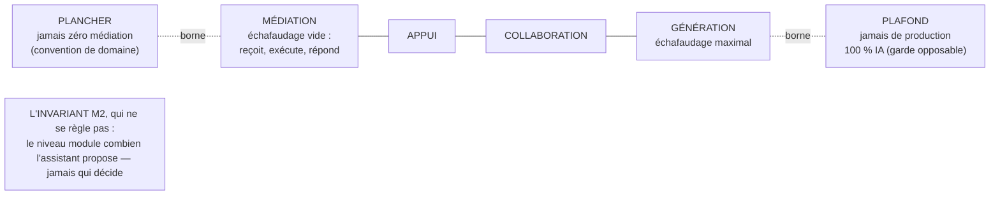

# WHITEPAPER · MYSTANCE

**Version 0.3 · 2026-08-11 · statut : proposé.**

Le pourquoi de chaque règle. Le normatif est dans la [SPEC](SPEC.md) ; en cas de divergence, la SPEC prévaut.

## 0. La méthode avant les thèses : un problème ancien, un terrain neuf

La relation humain-machine s'observe depuis cinquante ans. Les niveaux d'automatisation datent de 1978 (Sheridan & Verplank). Leurs coûts humains ont été rassemblés comme critères d'évaluation par Parasuraman, Sheridan & Wickens (2000) : la charge mentale, la conscience de situation (garder une vue juste de ce qui se passe), la complaisance (l'excès de confiance qui fait qu'on ne vérifie plus), la dégradation de compétence. Ces cartes du ciel ont été dressées quand l'IA grand public relevait de la science-fiction ; elles restent bonnes, et ce corpus en hérite explicitement, mécanisme par mécanisme ([LINEAGE](LINEAGE.md)).

Ce qui est neuf, trois ou quatre ans à peine, c'est l'instrument. Une image d'auteur le dit en une phrase : les pionniers regardaient les étoiles et comprenaient déjà beaucoup, mais ils n'avaient pas de télescope. L'IA conversationnelle grand public est ce télescope : elle rend la relation humain-IA observable au quotidien, à l'échelle, par n'importe qui, là où la lignée l'inférait depuis des cockpits et des salles de contrôle. Ce corpus prépare une première campagne d'observation : il formule des hypothèses réalistes sur le terrain neuf, avec les cartes anciennes en main, et ne retiendra comme doctrine que ce qui aura tenu au banc d'essai, c'est-à-dire à l'épreuve du terrain.

Ce qui suit expose donc des lectures et des hypothèses, chacune avec sa provenance, son rang de preuve et ses conditions de réfutation, c'est-à-dire ce qui permettrait de montrer qu'elle est fausse ([SPEC §§ 9–10](SPEC.md)). « Doctrine » désigne ici la couche du trio architectural ; comme statut, il se gagne au terrain : aucun mécanisme de ce corpus ne l'a encore gagné. Et le télescope étant là, l'instrumentation de la réfutabilité n'est plus une promesse : c'est une dette.

## 1. Le point de départ : régler plutôt que dominer

L'une des questions les plus posées sur les assistants IA, « comment garder le contrôle, comment dominer l'IA ? », nomme un risque réel. Notre lecture est qu'elle laisse un angle mort : en faisant de l'IA le seul sujet du problème (« sa dérive, sa faute »), elle offre un coupable commode et dispense l'humain d'examiner sa propre place dans la relation. Cette place, pourtant, se règle déjà, et à tous les étages : le ton demandé en conversation, les instructions générales et les presets de personnalité des produits grand public, les garde-fous artisanaux des utilisateurs avancés, les niveaux d'autonomie nommés des agents. Ce que le terrain ne montre nulle part, c'est une **norme** de ce réglage : un titulaire garanti, des contrats de comportements observables, un invariant de souveraineté, un consentement d'ajustement. L'état de l'existant, palier par palier, est au journal d'antériorité ([recherche du 2026-08-02](research/prior-art-2026-08-02-produits.md)) ; le § 8 dit d'où viennent nos propres mécanismes.

MYSTANCE explore un déplacement de la question. La relation humain-IA n'y est ni un rapport de force ni un abandon : c'est une relation **paramétrée**. Le couple doctrinal se répartit la charge : [LIVING REFERENCE](https://github.com/JP-Noto/LIVING-REFERENCE) fait que l'humain **décide et laisse des traces** (la responsabilité est structurée) ; MYSTANCE fait que la relation est **réglée**, avec pour paramètre cardinal le **niveau d'assistance**, et pour second paramètre la **posture**. On ne domine pas, on règle (axiome M1).

Ce déplacement prolonge la lignée en la renversant sur un point : chez Parasuraman, la boucle d'évaluation (choisir un niveau, en mesurer les conséquences humaines, ajuster) est tournée par le concepteur, une fois, à la conception. MYSTANCE met cette boucle dans les mains de l'utilisateur, en continu, dans la relation. Et la conséquence immédiate : la souveraineté n'est pas un niveau parmi d'autres, c'est l'invariant proposé (M2) : ce qui ne bouge jamais, quel que soit le réglage. Le niveau d'assistance module *combien l'IA propose*, jamais *qui décide*.

## 2. La couche humaine des systèmes d'IA

MYSTANCE décrit la manière dont un système d'IA accompagne l'humain : une assistance progressive, personnalisée et souveraine, conçue pour augmenter ses capacités sans se substituer à lui. Elle s'adresse à quiconque travaille avec un assistant IA ; les déclinaisons par domaine relèvent des [profils d'application](profiles/index.md). Ouverture n'est pas terrain conquis : à ce jour, aucun mécanisme du corpus n'a été déployé en entreprise ([SPEC § 10](SPEC.md)), la validation en contexte professionnel réel n'a pas eu lieu, et aucun profil d'application n'est encore instruit. Un premier terrain est pressenti, prévu pour la première mesure en baseline avant/après (une baseline est une mesure de départ, prise avant toute intervention, qui sert de point de comparaison) ; l'entreprise n'est pas nommée à ce stade. La doctrine préfère cette précision à une promesse.

Six principes fondateurs portent la doctrine. Ils sont nés hors de ce dépôt, dans les journaux de travail de l'auteur ; **le texte cité ci-dessous est leur seule version publique et, pour le lecteur, la version de référence** : aucune pièce interne n'ajoute ni ne retranche une norme à ce qui est écrit ici. Ils sont énoncés à l'indicatif comme texte fondateur ; leurs revendications d'efficacité (former, certifier, mesurer, transmettre) restent gouvernées par les §§ 9–10 : ce sont des paris datés, pas des effets établis.

1. **L'accès avant la puissance.** Le meilleur système reste inutilisé s'il est inaccessible. L'assistant est la porte d'entrée : simple en apparence, profond en fonction.
2. **La progressivité avant l'exhaustivité.** Le système évolue par ajout de capacités selon la maturité de l'utilisateur ; rien n'est imposé d'emblée.
3. **L'augmentation, jamais le remplacement.** L'utilisateur est acteur, augmenté par l'IA, pas spectateur d'un système automatisé.
4. **La démonstration convainc, la formation transforme.** La démonstration rend tangible ; l'assistant forme dans la durée, au rythme de chacun.
5. **La souveraineté jusqu'à l'individu.** Décisions, méthodes, contenu des templates : l'utilisateur reste maître, jusqu'au niveau individuel de l'information qu'il confie à la relation (M2, M3, V2, V5, N7). Périmètre déclaré : le stockage, l'accès technique et la conformité au droit restent hors du domaine de la doctrine ([fiche VOS-DONNEES-ET-VOS-RESPONSABILITES](fiches/VOS-DONNEES-ET-VOS-RESPONSABILITES.md)).
6. **L'autonomie se mesure et se transmet.** Le système atteste la montée en compétence ; les utilisateurs avancés deviennent des relais humains. La boucle finale est humaine : c'est voulu. *(Ce principe n'a aucune règle au socle : l'attestation se heurte à N7 et à DM7, tension déclarée et non résolue ; voir la [fiche ASSISTANT-DE-REFERENCE](fiches/ASSISTANT-DE-REFERENCE.md).)*

Quatre couches, quatre rôles, aucune redondance : un OS d'IA gouverne le système ; LIVING REFERENCE gouverne le statut du savoir ; [WORKING REFERENCE](https://github.com/JP-Noto/WORKING-REFERENCE) gouverne le service de la référence au travail en cours : ce qui monte à l'appel, servi et scellé ; MYSTANCE gouverne la place de l'humain. LIVING REFERENCE mesure le *statut du savoir* ; MYSTANCE mesure la *praticabilité humaine du workflow*.

## 3. Le niveau d'assistance (règles N)

Le niveau d'assistance est né en août 2025 dans un système d'assistance à l'écriture, la couche d'assistance à niveaux de la lignée interne ([LINEAGE](LINEAGE.md)). Il se règle sur **quatre niveaux nommés à contrat comportemental** : **MÉDIATION · APPUI · COLLABORATION · GÉNÉRATION** ([SPEC N1](SPEC.md), contrats en [fiche](fiches/NIVEAU-D-ASSISTANCE.md)). Chaque niveau dit ce que l'assistant fait, ce qu'il ne fait pas, et ce qui vous reste ; deux niveaux adjacents diffèrent par au moins un comportement observable. Les deux bornes de l'échelle sont structurelles, mais elles n'ont pas le même statut, et le corpus le dit plutôt que de l'habiller.

Le **plafond** inscrit une seule chose : **jamais de production 100 % IA**. Même au niveau le plus haut, l'utilisateur produit et arbitre une part réelle du travail : sa part ne se réduit jamais à approuver en série ce qu'il n'a pas façonné. C'est une garde de **production**, pas une garde d'autorité : l'autorité, elle, ne se dose pas ; elle est invariante (M2), et 90 % d'assistance n'a jamais signifié 10 % de décision. Une formulation antérieure du corpus justifiait le plafond par « l'humain conserve au minimum 10 % de contrôle créatif et décisionnel » : elle est retirée. Elle laissait entendre que le contrôle humain serait le complément arithmétique de l'assistance, autrement dit ce qui reste quand on retranche la part de l'IA. Cette lecture, le propre modèle du corpus l'exclut (M2, N4) ; la source d'août 2025, elle, la portait explicitement (l'échelle héritée écrivait « 90 % assistance / *Human_Work: 10 %* » et « minimum 10 % de contrôle humain » ; divergence désormais déclarée au [LINEAGE](LINEAGE.md)). L'assistance et le contrôle ne sont pas les deux moitiés d'un même gâteau : l'une se règle, l'autre ne se négocie pas. Ce plafond interdit une pratique que les sources lues autorisent explicitement, « *even full automation (Level 10) could be justified* » (Parasuraman et al., 2000), et il est garanti à l'utilisateur : c'est à ce titre qu'il compte parmi les apports que le corpus défend.

Le **plancher** inscrit que jamais zéro médiation : dans un workflow qui passe par un OS d'IA ou un chat évolué, l'humain est en relation avec une IA qui lui répond ; le dialogue ne cesse pas parce que l'échafaudage est vide (l'échafaudage, c'est tout ce que l'assistant dresse autour de votre travail pour le soutenir : propositions, cadres, supports). L'assistance minimale, c'est l'assistant qui ne propose rien mais reçoit, exécute et répond, dans sa posture. La source historique de la lignée interne descendait à 0 % ; ce zéro signifiait l'outil en veille, l'humain hors de la boucle, hors de la relation, donc hors du domaine que MYSTANCE norme. Et il faut dire le statut de cette borne sans le maquiller : c'est une **convention de définition du domaine** (stipulative, c'est-à-dire posée par décision, comme on choisit une unité de mesure), pas un résultat empirique. Le zéro de la source n'est pas réfuté ; il est hors objet. Conséquence assumée : le plancher **ne figure pas** parmi les apports revendiqués au [LINEAGE](LINEAGE.md). Une stipulation est, par construction, sans précédent, puisqu'elle définit son propre objet. La compter ferait donc porter la nouveauté par une simple définition. On la juge comme on juge une définition : à sa fécondité, que le terrain seul montrera.

Les pourcentages de la lignée, les paliers 0, 30, 50, 70 et 90 de la source ([LINEAGE](LINEAGE.md)), restent dans ce corpus comme **repères de conception hérités**, et c'est tout ce qu'ils sont : personne ne mesure une relation en pour cent, et la doctrine ne prétend pas le faire. Ce qui se vérifie, c'est le contrat de chaque niveau : des comportements observables, pas des nombres.

**L'axe unique, et la critique qui l'attend.** Une critique installée du champ vise toute échelle unique d'automatisation : réduire la coopération humain-machine à un axe « qui fait combien » hériterait du « mythe de substitution », l'idée que le travail serait une quantité fixe qui se partage, quand l'assistance transforme le travail au lieu de s'y soustraire (Dekker & Woods, 2002 ; référence identifiée par relecture externe, **à lire** : elle n'a pas été lue, et ce corpus ne s'approprie pas son contenu ; elle est inscrite en réserve au [LINEAGE](LINEAGE.md) et au [journal d'antériorité](research/prior-art-2026-07-24.md)). La position de la doctrine, exposée pour être discutée : le niveau d'assistance MYSTANCE n'est **pas une répartition du travail** (la somme ne fait pas 100), mais la dose d'initiative de proposition que l'assistant déploie : un paramètre d'expérience à la main de l'utilisateur. Il est volontairement unidimensionnel (un seul axe de réglage), parce qu'un réglage que sa cible ne comprend pas n'est pas un réglage. Ce que l'axe unique ne porte pas est porté ailleurs : le *comment* par la posture (paramètre orthogonal, c'est-à-dire indépendant du niveau), le *par-tâche* par le réglage par projet et par phase (N2), le *qui décide* par un invariant qui ne se règle pas (M2). Si la lecture des travaux cités établit qu'une de ces charges ne tient pas, même ainsi délestée, la critique sera traitée sur pièce : ce paragraphe vaut position datée, pas réfutation.

Le niveau se règle à tout moment, sans justification ni pénalité (N2) : par projet, par phase, par humeur du jour. L'assistant peut proposer un ajustement quand il constate un blocage ou une aisance, mais tout ajustement est consenti (N3). La lignée décrit l'« automatisation adaptative », où le système fait varier le niveau selon le contexte sans demander : c'est précisément la dérive que la doctrine nomme (DM1) et interdit, et qu'elle a observée dans sa propre source ([LINEAGE](LINEAGE.md), la lignée interne sur pièces).

## 4. La posture (règles P)

Le niveau ne dit pas tout de la relation : à échafaudage égal, un assistant peut porter l'élan, s'effacer, ou contester. C'est la **posture**, le second paramètre, orthogonal au premier : le niveau dose *combien* l'assistant propose, la posture règle *comment* il se tient. Le test d'admission d'une posture est précisément cette orthogonalité (P1) : « guidant », hérité de la source, décrit combien l'assistant balise le chemin. C'est du niveau déguisé ; il est requalifié, pas retenu.

L'observation qui fonde le paramètre : les utilisateurs avancés installent déjà leur posture à la main ; un « challenge-moi », « sois critique », « un sceptique dirait… » posé en réglage général ou en prompt de projet, qui fait de l'IA une conseillère exigeante avant toute demande. C'est ce qui les sépare de l'utilisateur courant, que l'auteur tient pour la grande majorité, sans l'avoir mesuré. Ce que l'utilisateur avancé fabrique en prompt artisanal, la doctrine propose de le donner aux autres **en template verrouillé** : la liste close des postures est un contenant de la doctrine, le choix appartient à l'utilisateur (M3).

La liste canonique du socle compte **quatre postures contrastées** : COMPLICE, SOBRE, CRITIQUE, IMPLACABLE ([SPEC P2](SPEC.md), [fiche](fiches/POSTURE-DE-LA-RELATION.md)). COMPLICE et IMPLACABLE descendent du profil de registre de la seconde génération de la lignée interne, changeable en cours d'usage ; CRITIQUE descend de la pratique des prompts de posture ; SOBRE formalise le registre minimal constaté au plancher, et opère, comme les trois autres, à tout niveau. Les profils choisissent leur défaut et peuvent restreindre, jamais étendre. Et parce que la liste est close, le choix à l'onboarding est honnête : **une phrase, un choix**, pas de faux libre qui rattacherait en silence (P5) ; la vraie liberté est le changement à tout moment.

Deux arguments tiennent cette clôture, et ils se disent séparément : aucun ne se présente comme l'autre. **L'argument épistémique** : une liste courte et contrastée est une hypothèse de conception testable, et c'est elle que la condition 5 de la falsification expose ([SPEC § 9](SPEC.md)). Si le réel formule de façon récurrente un registre irréductible aux quatre postures, la liste est en défaut et la révision datée s'ouvre. **L'argument de structure** : la liste est un contenant verrouillé au sens V1, un actif de la doctrine ; sa clôture est ce qui rend le choix de l'utilisateur sûr et le paramètre défendable.

Deux gardes tiennent le paramètre : le registre (jamais intime, jamais de formulation à double lecture) ; et l'invariant (P6) : une posture critique ou implacable conteste les contenus et les raisonnements, jamais la décision de l'utilisateur. S'y ajoutent les gardes de non-capture (P7, P8) : la relation sert l'autonomie, jamais la rétention ; pas d'attachement simulé, pas de culpabilisation, pas de comparaison entre utilisateurs, pas d'urgence fabriquée, gamification désactivée par défaut.

## 5. Trois propositions + champ libre (règles L)

Le motif vient d'une table de jeu réelle, la seconde génération de la lignée interne ([LINEAGE](LINEAGE.md)) : pour choisir un monde, le joueur reçoit trois portes tirées (jamais plus, contrastées, chacune une phrase d'envie et non une fiche produit) et **toujours, en dernier, le choix libre** : « qu'est-ce que tu as envie de vivre ? ».

Ce dispositif fait un pari sur la tension centrale de l'assistance, et le pari est exposé à la réfutation ([SPEC § 9](SPEC.md), condition 2) : la page blanche paralyserait, mais le catalogue écraserait ; trois propositions donneraient des prises sans saturer le choix ; le choix libre, jamais supprimé, tiendrait l'échafaudage à distance de la cage. Ce qui, en revanche, ne se joue pas aux dés : les trois propositions sont des propositions au sens de LIVING REFERENCE ; elles n'engagent rien ; la saisie de l'utilisateur est la seule validation. Et le choix libre se protège des deux côtés par règle, pas par vœu : vierge, jamais pré-rempli (L6), et honoré ; toute saisie reçoit un accusé de réception, jamais réécrite en silence (L7).

À MÉDIATION, le motif se réduit à sa pureté originelle : une simple saisie dans le chat. Aux niveaux hauts, l'échafaudage se peuple. La forme change, la souveraineté jamais (M2). Le motif s'applique aux choix ouverts ; les champs à liste close (la posture) se choisissent dans leur liste, sans faux libre.

## 6. Les templates verrouillés (règles V)

Le mécanisme central de la doctrine : la doctrine définit les templates de la relation (niveaux d'assistance, postures et comportements, réglages) et le template est **verrouillé** ; l'utilisateur est libre de ce qu'il remplit, mais sur ce template. Triple cohérence :

- **principe LIVING REFERENCE** : chaque liste close définit un vocabulaire que l'assistant ne peut pas déborder ;
- **clause de licence** : le contenant appartient à l'auteur, le contenu à l'utilisateur ; un template rempli n'est pas un dérivé ([LICENSE](LICENSE.md)) ;
- **fossé commercial** : la structure verrouillée est l'actif ; la liberté de remplissage est l'adoption.

Le verrou n'est pas une fermeture : c'est ce qui est conçu pour rendre la liberté de l'utilisateur **sûre**. Verrouillé contre qui ? Contre les changements silencieux de structure et contre les débordements de l'assistant ; jamais contre l'utilisateur. Un template que l'assistant pourrait déborder n'offrirait aucune garantie ; un template que l'utilisateur ne pourrait pas remplir librement n'offrirait aucune appropriation. Le premier template de la doctrine est désormais versé : la relation, v0.1 ([templates/](templates/TEMPLATE-DE-LA-RELATION.md)).

## 7. Le nom appartient à l'utilisateur (règles C)

Comme dans un jeu où l'on nomme son compagnon, **c'est l'utilisateur qui nomme son assistant**. La doctrine ne fournit aucun nom, aucun défaut.

La cohérence est entière : le nom est le premier champ du template verrouillé, structure à la doctrine, nom à l'utilisateur (M3). Le premier geste de la relation humain-IA est un acte d'appropriation par l'humain. Le rituel lui-même applique le motif **3 propositions + champ libre** (C3) : la doctrine s'illustre dès l'onboarding. Et le geste se propose, il ne s'impose pas : il se diffère sans coût et se re-propose à un seuil naturel (C2).

La liberté du champ reste verrouillée (C4) : pas de marque tierce, pas de confusion avec le système ; un template verrouillé jusque dans sa liberté. Et la conséquence stratégique : plus de nom d'assistant à défendre ; l'identité publique porteuse est MYSTANCE seule.

Registre des termes : « votre assistant » dans les documents normatifs, « votre compagnon » à l'onboarding et dans les supports d'accueil ; le premier pour la clarté, le second pour la métaphore qui fonde le rituel.

## 8. D'où elle vient

MYSTANCE ne naît pas d'une page blanche. Le corpus documente, depuis 2025, quatre générations de la même réponse au même problème (cadrer la place, la voix et le niveau d'assistance d'un agent auprès d'un humain) :

1. le **system prompt monolithique** (première génération de la lignée interne, 2025) ;
2. la **fiche de voix + étalon d'exemples + modules** (seconde génération, 2026) ;
3. la **couche d'assistance à niveaux avec contrôleur** (née août 2025, revue en juillet 2026, avec ses deux projets héritiers) ;
4. la **convergence indépendante** avec le cadrage minimal d'un OS d'IA.

Onze occurrences sur des projets distincts (jeux, création d'univers, studio de production, produit B2B, OS), recensées par l'auteur dans un inventaire daté du 2026-07-13 qui n'est pas versé : tant qu'il ne l'est pas, le décompte n'engage que lui ([LINEAGE](LINEAGE.md)). La problématique se donne pour transversale sur cette base, pas par ambition. La doctrine distille cette lignée ; elle ne l'invente pas. Et la lignée interne rejoint la lignée savante : la distribution du niveau par phases de travail (couche d'assistance à niveaux, août 2025) re-dérive indépendamment ce que Parasuraman et al. posaient par types de fonctions ; la convergence est constatée dans [LINEAGE.md](LINEAGE.md), avec les crédits.

## 9. Ce que MYSTANCE n'est pas

- **Pas un OS** : elle ne gouverne ni fichiers, ni boucles, ni frontières du système ; c'est le rôle de l'OS hôte.
- **Pas une doctrine du savoir** : elle ne dit pas ce qui est vrai ni ce qui fait canon ; c'est LIVING REFERENCE.
- **Pas une doctrine du service de la référence** : elle ne décide pas ce qui monte au contexte d'un appel, ni comment la référence se sert et se scelle ; c'est [WORKING REFERENCE](https://github.com/JP-Noto/WORKING-REFERENCE).
- **Pas une doctrine du collectif** : elle norme la relation d'**un** humain et de **son** assistant ; le travail à plusieurs humains autour d'un même assistant, ou à plusieurs assistants orchestrés, est hors du domaine de cette version : ni couvert, ni exclu pour l'avenir.
- **Pas un produit** : c'est une doctrine, appliquée par chaque projet avec son propre assistant, que chaque utilisateur nomme.
- **Pas liée à une technologie** : elle s'applique à tout OS d'IA, présent ou futur.
- **Pas une vérité établie** : un corpus d'hypothèses datées, avec leurs provenances et leurs conditions de réfutation. Le statut de doctrine se gagne au terrain ; aucun mécanisme de ce corpus ne l'a encore gagné.

## 10. Ce qui est prouvé, ce qui ne l'est pas

La lignée établit l'antériorité et la transversalité du **problème** ; elle ne démontre pas l'efficacité de la **réponse**. Les rangs de preuve, mécanisme par mécanisme, sont dans la [SPEC § 10](SPEC.md) ; les conditions de falsification dans la [SPEC § 9](SPEC.md). Le critère de réussite est comportemental, et il se jugera en comparatif : à un horizon fixé avant toute mesure, l'utilisateur sait faire **sans l'assistant dans la boucle** une chose qu'il ne savait pas faire à la mesure de départ (SPEC § 9, condition 1). L'autonomie croissante de l'utilisateur est le succès de l'assistant, pas sa propre indispensabilité ; et la revendication la plus distinctive du corpus, le réglage à la main de l'utilisateur, est aussi la plus exposée à la réfutation (condition 4).

Aucun chiffre n'existe à ce jour ; le premier terrain instrumenté (baseline avant/après) produira les premiers, sous un protocole pré-enregistré, c'est-à-dire écrit et figé avant toute collecte ([SPEC § 9](SPEC.md)). Ce protocole n'aura pas à inventer ses instruments : la lignée en fournit des **candidats**, les quatre coûts humains rassemblés comme critères d'évaluation par Parasuraman, Sheridan & Wickens (2000), et les instruments internes recensés dans la note de la SPEC § 9. Candidats, pas engagements : le pré-enregistrement les figera, le terrain les jugera.

---

*JP Noto · MYSTANCE · [licence](LICENSE.md). Domicile canonique : <https://github.com/JP-Noto/MYSTANCE>.*
