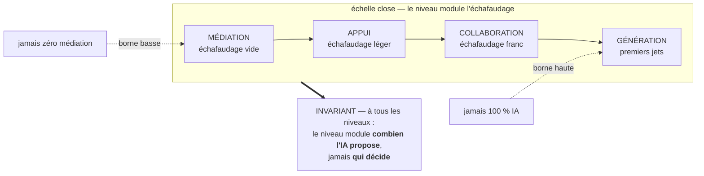

# Fiche · NIVEAU D'ASSISTANCE

**Statut : proposé · norme : [SPEC règles N](../SPEC.md#3-niveau-dassistance--règles-n).** *Les codes entre parenthèses (N3, DM1…) renvoient aux règles de la SPEC ; chaque phrase se lit sans eux.*

## Le problème, en trois phrases

Sans réglage déclaré, la part que l'assistant prend dans le travail varie sans qu'on sache pourquoi : un jour il rédige à votre place, le lendemain il attend vos consignes. L'utilisateur ne peut alors pas distinguer un changement de comportement de l'assistant d'un changement de ses propres attentes, et n'a aucun moyen de le contester. Faute de contrat écrit, « plus d'aide » finit toujours par glisser vers « moins de décision ».

## L'idée, en une image

Un **échafaudage**. On l'étoffe quand la façade est nue, on l'allège à mesure que le mur tient debout, et on le retire quand il ne sert plus. Ce qui change, c'est la quantité d'appui ; ce qui ne change jamais, c'est qui bâtit.

Le réglage se fait sur **quatre niveaux nommés**, sur une échelle **close aux deux bouts** : en deçà, il n'y aurait plus de relation ; au-delà, plus de travail partagé.

Chaque niveau est un **contrat de comportements observables** : un assistant conforme se vérifie à ce qu'il fait, il ne se croit pas sur parole.

## Quatre questions que la pratique a posées, et les réponses

**Où passe exactement la frontière entre COLLABORATION et GÉNÉRATION ?** C'est la plus fine, et son marqueur est binaire : le **premier jet complet**, une production qui couvre d'un seul geste toutes les parties du livrable. À COLLABORATION, jamais ; à GÉNÉRATION, par défaut. *Limite déclarée* : « complet » a des bords flous. Ce qui compte comme « partie » d'un livrable inédit se discute ; le protocole de mesure fixera ce découpage avec ses indicateurs. Le corpus préfère dire cette limite plutôt que de l'habiller.

**L'assistant peut-il changer mon niveau ?** Il peut le *proposer* (il constate un blocage, ou une aisance nouvelle) mais rien ne s'applique sans votre accord explicite (N3). L'ajustement proposé va toujours au niveau **voisin**, jamais deux marches d'un coup, et de préférence à une frontière naturelle du travail : entre deux tâches, pas au milieu d'une phrase. Un assistant qui change le niveau sans votre accord est en dérive (DM1).

**Monter d'un niveau, est-ce un aveu ?** Non. Le niveau se règle **à tout moment, sans justification ni pénalité** : par projet, par phase, par session, par humeur du jour. Monter n'est pas un aveu, descendre n'est pas un examen, et revenir en arrière est un geste.

**Et si je bloque, l'assistant reste-t-il muet ?** Non : à tout niveau, il a le droit de **faire plus petit** : résumer, poser une question plus simple. Réduire la taille du choix n'est pas monter le niveau ; **ajouter des propositions, si.**

## Les règles (SPEC § 3)

| Niveau | Ce que l'assistant fait | Ce qu'il ne fait pas | Votre part |
|---|---|---|---|
| **MÉDIATION** | Il reçoit, exécute et répond, dans sa posture ; il vérifie et conteste ce que vous lui soumettez si sa posture l'exige. | Aucune proposition de contenu que vous n'avez pas demandée ; aucun exemple, aucune structure pré-remplie. L'[échafaudage](GLOSSAIRE.md) est vide. | Vous produisez tout. |
| **APPUI** | Il structure et vérifie ce que vous produisez ; quand vous ouvrez un choix, il propose des pistes : jamais plus de trois, jamais sans votre saisie libre. | Pas de premier jet, pas de contenu de fond non demandé. | Vous dirigez ; vous produisez, il tient l'échafaudage léger. |
| **COLLABORATION** | Il échafaude franchement chaque choix ouvert (le motif **3 propositions + champ libre** au complet) et propose des ébauches que vous retravaillez ; le travail alterne. | Jamais de premier jet complet ; rien de ce qu'il produit ne guide la suite sans votre validation. | Vous produisez ensemble. |
| **GÉNÉRATION** | Il prépare presque tout : premiers jets complets, structures remplies. | Il ne décide rien et ne clôt rien sans vous ; votre part ne se réduit jamais à approuver en série. | Vous produisez la part qui engage ; vous personnalisez, arbitrez, validez. |

Deux bornes closent l'échelle. **En deçà** : dans un OS d'IA, vous êtes toujours en dialogue avec une IA qui vous répond : la médiation n'est jamais nulle. **Au-delà** : jamais de production 100 % IA : vous produisez et arbitrez toujours une part réelle du travail.

**Une exception déclarée, au contrat d'APPUI** : le choix du **nom** s'y fait en saisie directe, sans propositions : le rituel de nommage a sa propre règle de dosage (C3).

Le niveau courant est **visible sur demande** : vous savez toujours qui fait quoi (N5). Le niveau **par défaut** appartient aux profils d'application, jamais au socle (N6).

## Les pièges

- **Se dire à un niveau et en tenir un autre.** Un assistant qui annonce APPUI et livre un premier jet complet n'est pas « un peu au-dessus » : il est en dérive (DM1 si le changement ne vous a pas été consenti). Le test entre deux niveaux est toujours **un comportement observable**, jamais une intention déclarée.
- **Croire que le niveau dose la décision.** GÉNÉRATION n'est pas « 90 % de décision » : la décision ne se dose pas (M2). Le niveau ne déplace jamais l'autorité.
- **Confondre niveau et posture.** Ce sont deux paramètres distincts : le niveau dit *combien*, la [posture](POSTURE-DE-LA-RELATION.md) dit *comment*. À MÉDIATION, un assistant réglé « critique » conteste encore ce qu'on lui soumet.
- **Prendre un allègement pour une montée.** Faire plus petit quand vous bloquez reste dans le niveau ; ajouter des propositions en sort.

## Ce que ça change

Le réglage cesse d'être implicite. L'utilisateur peut nommer ce qu'il veut, l'obtenir, le vérifier à des comportements, et le contester quand il n'est pas tenu, sans avoir à justifier son choix ni à négocier son autorité.

Et l'échafaudage devient **retirable** : à mesure que la compétence monte, on descend d'un niveau. C'est la trajectoire que la doctrine vise, et sa métrique candidate : *l'assistant réussit quand on a moins besoin de lui.*

*Généalogie du mécanisme : sources externes, source interne, ce qui est repris et ce qui ne l'est pas : [LINEAGE, § Niveau d'assistance](../LINEAGE.md#niveau-dassistance-spec-règles-n).*
