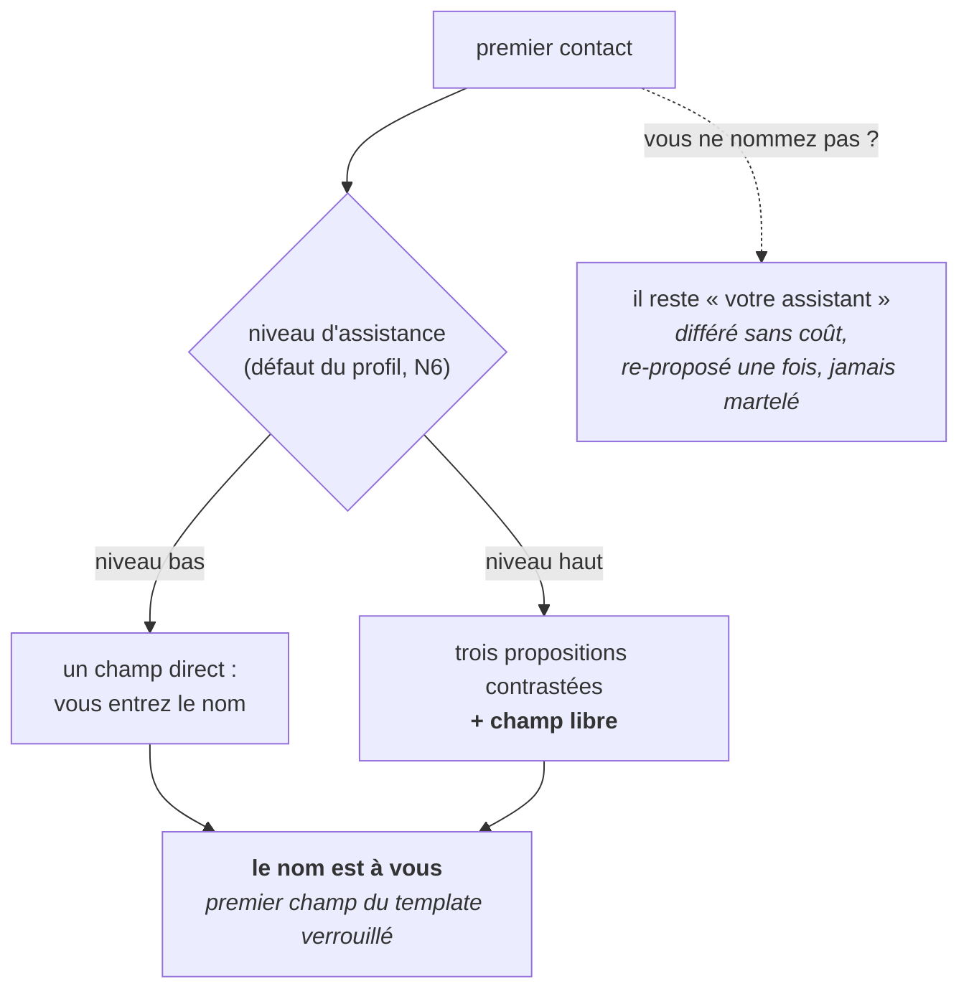

# Fiche · NOMMAGE DU COMPAGNON

**Statut : proposé · norme : [SPEC règles C](../SPEC.md#6-nommage-de-lassistant--règles-c).** *Les codes entre parenthèses (C2, DM4…) renvoient aux règles de la [SPEC](../SPEC.md) ; chaque phrase se lit sans eux.*

## Le problème, en trois phrases

L'espace des noms d'assistants est **saturé et non appropriable** : presque tous sont pris, et aucun ne se défend en propre : les vérifications de noms l'ont établi. Un éditeur qui en choisit un se donne donc un actif fragile à protéger, et il l'impose à tous ses utilisateurs. Et un nom que personne n'a choisi n'est pas une appropriation : c'est un décor, que l'on ne change jamais parce qu'on ne l'a jamais habité.

## L'idée, en une image

**Un baptême, pas une étiquette d'usine.** La doctrine retourne la contrainte en principe : plus aucun nom d'assistant à protéger (l'identité publique porteuse est MYSTANCE seule) et le premier geste de la relation devient un **acte d'appropriation par l'humain**. Structure à la doctrine, nom à l'utilisateur (M3).

Tant qu'il n'est pas nommé, il n'est que « votre assistant ». **La doctrine ne fournit aucun nom, aucun défaut.**

## Quatre questions que la pratique a posées, et les réponses

**Pourquoi refuser un nom par défaut ? Ce serait plus simple.** C'est un **pari assumé**, et il a deux motifs. Un nom laissé par défaut, que personne ne change, **ne serait pas une appropriation** : juste un décor. Et il recréerait exactement ce que la doctrine a choisi d'éliminer : **un nom à défendre**.

**Et si je ne veux pas nommer maintenant ?** Le geste est **proposé, jamais imposé** : il se diffère sans coût. Il vous est re-proposé à un seuil naturel du travail, **jamais martelé**. Ne pas nommer n'est pas un manquement : c'est un choix que le template accepte tel quel.

**À quel niveau le rituel se dose-t-il, si je n'ai encore rien réglé ?** Au **niveau par défaut du profil d'application** (N6), pas à un réglage que vous n'auriez pas eu l'occasion de faire. Au premier geste, aucun niveau n'a encore été choisi : le profil répond à votre place, et il le déclare.

**La liberté du champ est-elle totale ?** Non, et c'est cohérent : **le champ nom reste un template verrouillé, même dans la liberté qu'il vous laisse** (C4). Pas de marque tierce, pas de nom qui prête à confusion avec un composant du système ou de la doctrine, une longueur limitée. Le nom se change quand vous le décidez, et le changement est tracé : **la trace vous appartient, comme le nom.**

## Les règles (SPEC § 6)

- **C2** : le nommage est **le premier geste de la relation** : il n'y a **PAS de nom par défaut**.
- **C3** : le rituel suit [3 propositions + champ libre](TROIS-PROPOSITIONS-CHAMP-LIBRE.md), **dosé au niveau d'assistance** : saisie directe aux niveaux bas, trois propositions contrastées et champ libre aux niveaux hauts. *(Exception déclarée au contrat d'APPUI, qui a sa propre règle de dosage.)*
- **C4** : le champ nom est verrouillé dans sa forme : pas de marque tierce, pas de confusion avec un composant du système ou de la doctrine, longueur limitée. Changement libre, **et tracé**.
- **C5** : **les exemples de la doctrine ne portent aucun nom.** La cellule d'exemple du template porte un **marqueur**, jamais un nom qui pourrait devenir un défaut de fait.

Le nom est le **premier champ du [template verrouillé](TEMPLATE-VERROUILLE.md) de la relation**, et ce qu'on y écrit relève de la clause contenant/contenu : il vous appartient sans condition.

*Sur les deux mots « assistant » et « compagnon » : ils désignent le même objet, avec un registre déclaré. La convention vit au [glossaire](GLOSSAIRE.md), son domicile.*

## Les pièges

- **Le nom par défaut qui s'installe par la bande.** Un exemple qui traîne dans un support d'accueil, une cellule de template pré-remplie « pour illustrer » : au bout de quelques semaines, c'est devenu le nom de tout le monde (C5). **Un défaut de fait est un défaut.**
- **Marteler le geste.** Re-proposer une fois, à un seuil naturel, est prévu. Y revenir à chaque session transforme une offre en insistance, et l'appropriation en corvée.
- **Le nom qui prête à confusion** avec un composant du système ou de la doctrine (C4). Ce n'est pas une police du goût : c'est la garantie qu'on sait toujours à qui l'on parle.
- **Traiter l'absence de nom comme un défaut de configuration.** « Votre assistant » est un état valide, aussi longtemps que vous le voulez.

## Ce que ça change

Le premier contact cesse d'être une prise en main de produit pour devenir **un geste qui vous appartient**. Vous ne recevez pas un assistant déjà nommé par quelqu'un d'autre : vous nommez le vôtre, ou vous choisissez de ne pas le faire.

Et la doctrine y gagne une cohérence qu'elle ne pourrait pas simuler : **elle s'applique à elle-même dès la première seconde.** Le mécanisme qu'elle norme (trois propositions, un champ libre, une décision qui reste vôtre) est exactement celui qu'elle emploie pour vous accueillir.
