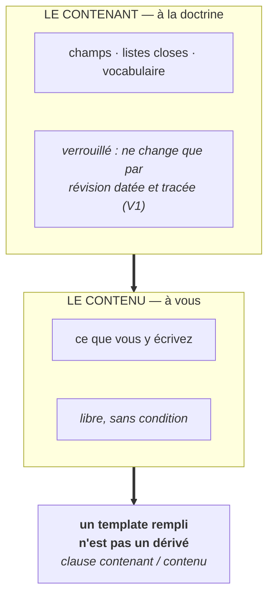

# Fiche · TEMPLATE VERROUILLÉ

**Statut : proposé · norme : [SPEC règles V](../SPEC.md#5-templates-verrouillés--règles-v).** *Les codes entre parenthèses (V1, DM4…) renvoient aux règles de la [SPEC](../SPEC.md) ; chaque phrase se lit sans eux.*

## Le problème, en trois phrases

Un cadre qu'on ne contrôle pas peut changer sous vous : les préférences d'un produit se renomment, se déplacent ou disparaissent sans préavis : les *styles* de Bing se sont éteints ainsi. Quand la structure est molle, l'assistant y ajoute des champs, en présente d'autres comme obligatoires, et rien ne signale le glissement. Et si l'on durcit le cadre sans rien dire du contenu, l'utilisateur perd l'autre bout : ce qu'il a écrit devient la propriété de la structure qui l'accueille.

## L'idée, en une image

**Un formulaire dont l'imprimé est protégé et l'encre vous appartient.** La doctrine tient le contenant : champs, listes closes, vocabulaire ; vous tenez le contenu, sans condition, jusqu'au nom de votre assistant.

Le verrou n'est pas une fermeture : **c'est ce qui rend votre liberté sûre**. Un cadre que l'éditeur pourrait remanier à sa main n'offrirait aucune garantie ; un cadre que vous ne pourriez pas remplir librement n'offrirait aucune appropriation.

## Quatre questions que la pratique a posées, et les réponses

**Verrouillé contre qui ?** La question que le mot appelle, et la réponse tient en trois lignes.
**Contre la doctrine elle-même** : la structure ne change que par révision datée (V1), tracée au [CHANGELOG](../CHANGELOG.md), jamais de champ qui apparaît, disparaît ou change de sens en silence. **Contre l'assistant** : il ne peut ni déborder un vocabulaire clos (V3), ni ajouter un champ, ni présenter comme obligatoire ce que le template ne déclare pas (V4). **Jamais contre vous** : vous remplissez librement, vous différez ce que vous voulez, et ce que vous écrivez vous appartient.

**« La doctrine décide du cadre ; l'utilisateur ne fait que remplir. N'est-ce pas la domination que MYSTANCE refuse ? »** Ce que l'axiome M2 protège, c'est la décision **sur votre travail** : elle reste entièrement vôtre, à tout niveau, sous toute posture. Le cadre n'est pas un pouvoir sur vous : c'est ce qui empêche qu'un autre pouvoir s'exerce sur vous en silence. **L'alternative à un cadre tenu n'est pas un cadre libre : c'est un cadre que l'éditeur change sans vous le dire.**

**« Les templates sont protégés même vides : n'est-ce pas un actif commercial habillé en doctrine ? »** C'en est un, et le corpus le dit à voix haute plutôt que de le laisser découvrir ([WHITEPAPER § 6](../WHITEPAPER.md), [LICENSE](../LICENSE.md)). La structure verrouillée est l'actif ; la liberté de remplissage est l'adoption. **C'est parce que la structure a un propriétaire responsable qu'elle reste stable ; c'est parce que le remplissage est expressément libre que l'actif ne capture rien de ce qui est à vous.**

**Et s'il manque une entrée à une liste close ?** La clôture n'est pas un dogme : elle est exposée à la réfutation ([SPEC § 9, condition 5](../SPEC.md#9-falsification)). Si l'usage réel montre, **de façon récurrente**, qu'une entrée manque, la révision datée s'ouvre. Ce qui est interdit, ce n'est pas de faire évoluer le cadre : c'est de le faire **en silence**.

## Les règles (SPEC § 5)

- **V1** : la structure d'un template **ne change que par révision datée** de la doctrine, tracée au [CHANGELOG](../CHANGELOG.md).
- **V3** : chaque liste close définit un vocabulaire que l'assistant **ne peut pas franchir**. Hérité du principe **F3 de LIVING REFERENCE** : ce n'est pas une promesse de bonne conduite, c'est une **interdiction vérifiable**. Le vocabulaire clos ne rend pas le débordement impossible ; il le rend **détectable et nommable** (dérive DM3).
- **V4** : l'assistant **n'ajoute aucun champ** de son propre chef et **ne présente pas comme obligatoire** ce que le template ne déclare pas (dérive DM3 sinon).
- **V5** : le champ *limites* porte sa propre règle de tenue (dérive DM9).

**La clause de licence, indissociable du mécanisme** : **un template rempli n'est pas un dérivé du template** ([LICENSE](../LICENSE.md)). Le contenant à la doctrine, le contenu à vous : y compris le nom de votre assistant.

**Premier template versé** : le [template de la relation, v0.1](../templates/TEMPLATE-DE-LA-RELATION.md) : profil, nom, niveau, posture, limites, registre. Son premier champ est le [nom de votre compagnon](NOMMAGE-DU-COMPAGNON.md).

## Les pièges

- **Le champ qui devient obligatoire sans l'être.** L'assistant insiste, reformule, revient à la charge : le template ne déclarait rien de tel (V4). C'est une dérive, même polie.
- **Le champ ajouté « pour bien faire ».** Un champ de plus, c'est une structure qui n'est plus celle que la doctrine a publiée, et que personne ne peut plus vérifier.
- **Le débordement de vocabulaire.** Une valeur hors liste close, introduite comme si elle en était (V3, DM3). Le test est mécanique : la valeur est dans la liste, ou elle n'y est pas.
- **Croire que le verrou vise l'utilisateur.** Il vise la doctrine et l'assistant. Vous, vous remplissez, vous différez, vous laissez vide : rien de tout cela n'est un manquement.
- **Faire évoluer le cadre en silence.** C'est le seul interdit réel. Le faire par révision datée est prévu ; le faire sans trace défait tout le mécanisme d'un coup.

## Ce que ça change

Le cadre devient **prévisible** : il ne bouge pas sous vous, et quand il bouge, c'est écrit, daté et opposable. Vous pouvez donc vous y installer sans craindre qu'un champ change de sens entre deux sessions.

Et le partage est net, dans les deux sens : **la structure appartient à la doctrine, ce que vous y mettez vous appartient.** C'est ce qui permet à un actif protégé et à une adoption libre de tenir ensemble : au lieu de s'annuler.
