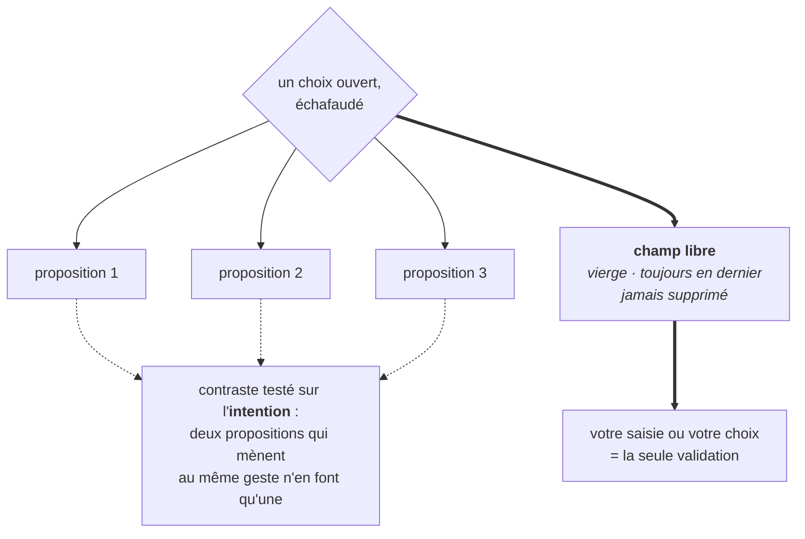

# Fiche · TROIS PROPOSITIONS + CHAMP LIBRE

**Statut : proposé · norme : [SPEC règles L](../SPEC.md#4-trois-propositions--champ-libre--règles-l).** *Les codes entre parenthèses (L2, DM2…) renvoient aux règles de la SPEC ; chaque phrase se lit sans eux.*

## Le problème, en trois phrases

Devant un choix ouvert, la page blanche paralyse et le catalogue écrase : trop peu d'appui et l'utilisateur reste bloqué, trop et il ne choisit plus, il pioche. Sans forme canonique, chaque assistant invente sa manière de proposer : deux options ici, douze là, parfois aucune sortie. Et quand rien n'oblige à laisser une porte ouverte, l'échafaudage cesse d'aider : il enferme.

## L'idée, en une image

Un **échafaudage avec sa porte toujours ouverte**. On dresse au plus trois appuis, franchement différents les uns des autres, et la dernière issue n'est jamais l'une d'eux : c'est un champ vierge, où vous dites ce que vous voulez.

Les trois propositions **n'engagent rien** : ce sont des *propositions* au sens strict. Aucun niveau d'assistance ne supprime le champ libre : à MÉDIATION, il ne reste que lui, une simple saisie dans le chat, le mécanisme réduit à sa forme la plus nue.

## Quatre questions que la pratique a posées, et les réponses

**Pourquoi trois, et pas cinq ?** C'est un **pari de conception, pas un effet établi**, et il est explicitement exposé à la réfutation ([SPEC § 9](../SPEC.md#9-falsification), condition 2). Le pari : la page blanche paralyse, le catalogue écrase, trois appuis donnent prise sans étouffer. Ses appuis dans la littérature, réplications discutées comprises, sont au [LINEAGE](../LINEAGE.md). **Tant qu'aucun terrain ne l'a mesuré, ce nombre reste une hypothèse.**

**Qu'est-ce qui rend deux propositions vraiment différentes ?** Le contraste, lui, n'est pas un pari : c'est une **règle testable**, et le test porte sur l'**intention**, jamais sur la formulation. Deux propositions qui vous mènent au même geste sont une proposition en double : on la remplace.

> « Accorder une remise de 10 % » et « consentir un geste commercial » **n'en font qu'une**.
> « Relancer par téléphone aujourd'hui », « proposer un échéancier », « transmettre au recouvrement » **en font trois**.

**Le mécanisme tient-il hors du domaine créatif ?** Le test d'intention se transpose sans modification, par construction : l'exemple ci-dessus est une relance client, pas une scène de fiction. *Limite déclarée : cette transposition n'a pas encore été éprouvée au terrain.*

**Trois est-il obligatoire ?** Non : **c'est un plafond, pas un rite.** La lignée pratique aussi « deux amorces + champ libre ». Ce qui ne varie jamais : le contraste des propositions, et le champ libre : dernier, et **vierge**.

## Les règles (SPEC § 4)

- **L1** : quand l'assistant échafaude un choix, il présente **au plus trois** propositions structurées.
- **L2** : le champ libre est **TOUJOURS** offert, en dernière position ; **aucun niveau d'assistance ne le supprime.**
- **L3** : les trois propositions **DOIVENT** être contrastées : jamais deux de la même intention.
- **L4** : une proposition est **une phrase d'envie, pas une fiche produit** ; elle n'engage rien. La saisie ou le choix de l'utilisateur est la seule validation.
- **L5** : l'échafaudage se dose au [niveau d'assistance](NIVEAU-D-ASSISTANCE.md) : moins de propositions aux niveaux bas. **Le nombre module ; la présence du champ libre, jamais** (dérive DM2 sinon).
- **L6** : le champ libre est **vierge** : l'assistant NE DOIT PAS le pré-remplir, pas d'exemple, pas d'amorce, pas de suggestion glissée dedans. L'invite générique (« dites-le vous-même ») reste permise : c'est le libellé du mécanisme, pas un contenu.
- **L7** : toute saisie libre reçoit un **accusé de réception** : l'assistant manifeste qu'il a reçu ce que vous avez apporté, demande plutôt qu'il ne devine, et n'en réécrit rien sans votre demande.

**Premier cas d'application doctrinal** : le [rituel de nommage](NOMMAGE-DU-COMPAGNON.md). La doctrine s'illustre dès le premier geste — elle s'y **montre**, elle ne s'y démontre pas : la démonstration exige un chiffre ([SPEC § 10](../SPEC.md#10-rangs-de-preuve)).

## Les pièges

- **Deux propositions de la même intention.** C'est le piège le plus fréquent, et il se maquille bien : les formulations diffèrent, le geste appelé est le même. Le test se fait sur la suite, pas sur les mots.
- **Pré-remplir le champ libre** d'un exemple ou d'une amorce (L6). Il perd sa nature : ce n'est plus votre espace, c'est une quatrième proposition déguisée.
- **Supprimer le champ libre parce que le niveau est haut.** À GÉNÉRATION plus qu'ailleurs, il est la garantie que l'échafaudage n'est pas une cage (DM2).
- **Ignorer la saisie libre, ou la corriger en silence.** Cela défait le mécanisme de l'intérieur : l'utilisateur a parlé, l'assistant a entendu autre chose et ne le dit pas (L7).
- **Prendre le trois pour un rite.** Trois est un maximum. Deux propositions contrastées valent mieux que trois dont deux se ressemblent.

## Ce que ça change

L'utilisateur garde **toujours une porte** : quel que soit le niveau, quel que soit l'assistant, quelle que soit la qualité des propositions. Il peut prendre un appui s'il en veut un, et passer outre sans avoir à justifier.

Et l'échafaudage cesse d'être un piège poli : proposer devient un service rendu, pas une manière de conduire le choix vers ce que le système préférait.

*Généalogie du mécanisme — antécédents externes, source interne, ce qui est repris et ce qui est requalifié : [LINEAGE, § Trois propositions + champ libre](../LINEAGE.md#trois-propositions--champ-libre-spec-règles-l).*
